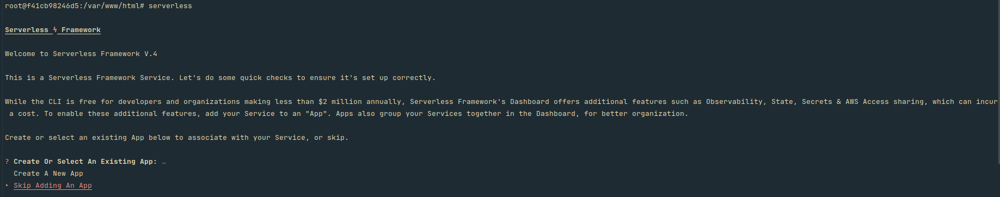

# 🐘 POC | Raw PHP Application + AWS Serverless Deploy

This is a proof of concept (POC) application to demonstrate how to configure Serverless deployment with raw PHP.

In this project, I'm using the Bref and the Serverless Framework (AWS) with Node.js.

My objective is to show how you can configure your raw PHP application, rather than to implement the most beatiful code (kekw). Obviously, this configuration can be applied to PHP applications using any framework, although some settings may differ.

The application consists of checking if an email domain is valid. I'm using mock data to simulate blocked domains, just as an example to demonstrate how it works.

## Configure Deployment

### Prerequisites

1. **Node.js and NPM**: Ensure that Node.js and NPM are installed in your environment.

2. **AWS Account**: You need an AWS account and an IAM user with the necessary credentials. If you don't know how to set this up, you can see the [AWS IAM documentation](https://docs.aws.amazon.com/IAM/latest/UserGuide/getting-started.html).

## Installation

### 1. Install Bref Plugin

Install the Bref plugin as a dependency using Composer:

```bash
composer require bref/bref --update-with-dependencies
```

### 2. Install Serverless Framework

Install the Serverless Framework using NPM. Here’s how to install:

```bash
npm install -g serverless
```

### 3. Configure Serverless Credentials

Assuming you already have the necessary AWS credentials, configure them using the Serverless Framework. Run:

```bash
serverless
```

Select option `Skip Adding An App`.



Chose `Save AWS Credentials in a Local Profile` and provide your access key and secret key to finalize the configuration.


### 4. Deployment

Deploy your application with:

```bash
serverless deploy
```


And you’re all set!

### Notes

- Make sure to replace placeholder values like `"your-key"` and `"your-secret"` with your actual AWS credentials.
- For more information, refer to the following resources:
    - [Bref Official Documentation](https://bref.sh/docs/)
    - [Bref Guide to Create Access Credentials](https://bref.sh/docs/setup/aws-keys)
    - [Serverless Framework Documentation](https://www.serverless.com/framework/docs/)
    - [AWS IAM Documentation](https://docs.aws.amazon.com/IAM/latest/UserGuide/)


## Setup Locally Application

Please ensure that Docker is installed on your local machine.

### 1. Building container

To build the container, execute:

```bash
docker compose up -d
```

### 2. Execute bash as root user:

To access the container as root, use:

```bash
docker compose exec -uroot app bash
```

### 3. Config your serverless credentials

Configure the Serverless Framework by using:

```bash
serverless
```

Select the option `Skip Adding An App`.


Chose `Save AWS Credentials in a Local Profile` and provide your access key and secret key to complete the configuration.


### 4. Deploy Application

To made deploy application, just run:

```bash
serverless deploy
```